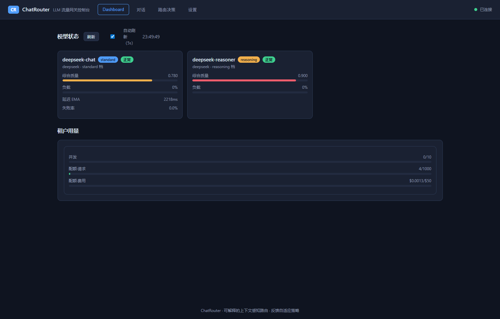
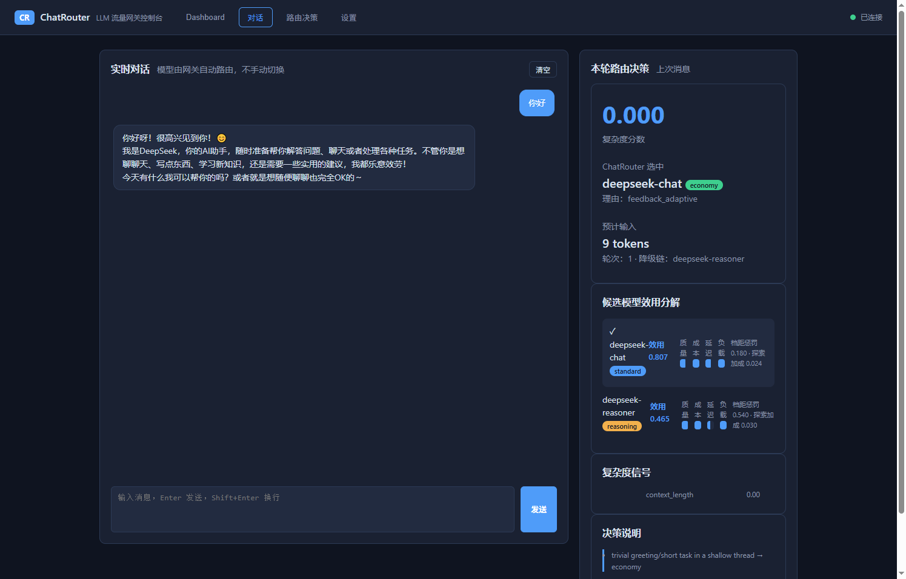
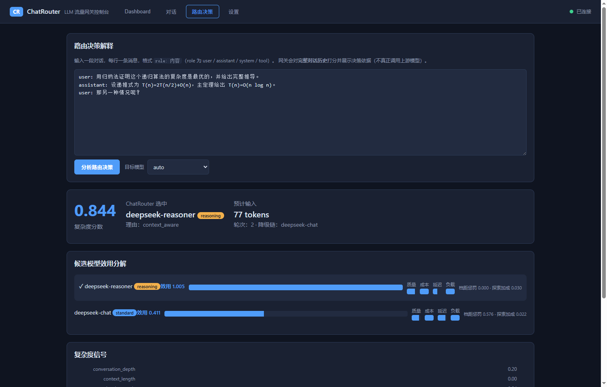
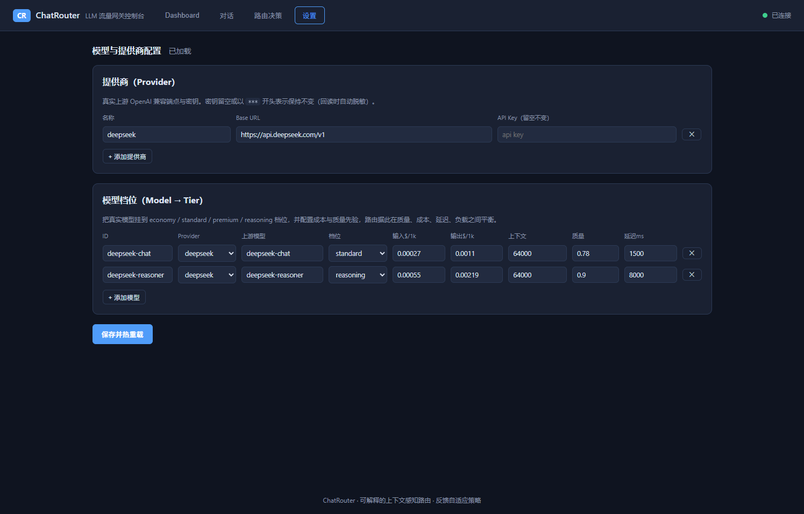

[English](README.en.md) · 中文

# ChatRouter

面向生产环境、兼容 OpenAI 协议的 LLM 流量网关，专注于**智能请求路由**与**精细化流量治理**。

作为 OpenAI SDK 的 drop-in 替换，ChatRouter 在单一入口后面统一管理多家供应商的模型池，在保障服务质量的前提下持续压降推理成本。

---

## 两大核心能力

### 1. 全对话上下文感知路由

朴素**单轮路由器（single-turn router）**只对**最后一轮用户提问**做难度判断，这在真实多轮对话中会系统性失准：

| 场景 | 单轮路由的判断 | 实际需求 |
|------|--------------|---------|
| `"那另一种情况呢？"` | 极简短 → 廉价模型 | 继承前文的复杂推导要求 |
| system 提示要求"所有回答必须给出严格证明" | 后续提问看似简单 | 全程需要强推理能力 |
| 用户连续三次回复"还是不对" | 每轮独立看都很短 | 当前档位已被证伪，必须升档 |
| 长达 40 轮的架构讨论 | 末轮只是一句追问 | 需同时满足累积的全部约束 |

> 上述失准是**单轮路由**的局限。ChatRouter 用**可解释的规则信号 + 近因加权**达到对话感知目标，无需训练数据、决策可逐条审计。

ChatRouter 对**完整对话历史**打分，通过三个机制避免上下文任务错配：

- **近因加权**：越近的轮次权重越高（`recency_decay`），但历史轮次始终保留影响力，早期声明的硬性要求不会被遗忘。
- **升级记忆**（`escalation_memory`）：一旦某个线程展现出高难度特征，加权均值会向历史峰值回拉——难任务不会因为一句"好的"就被悄悄降档。
- **指代继承**：识别 `"继续"`、`"那另一个呢"` 这类无独立语义的追问，直接继承前文的复杂度。

十个信号维度参与打分，中英双语识别：推理关键词、代码含量、对话深度、上下文压力、未解决线程（用户不满信号）、工具调用、结构化输出、指令密度、期望输出长度、多语言混合。

> **聚合方式**：得分并非简单加权平均。多数信号在单次请求中为零，纯均值会把"证明该定理"这类明确的强信号稀释到廉价档。因此实际采用 `主导信号 × 0.6 + 加权均值 × 0.4 + 交互项`，既保证单个决定性信号能主导决策，也让"多个中等信号叠加"同样被识别为高难度。

`/v1/routing/explain` 可直接查看完整决策依据，无需真实调用模型。

### 1b. 会话级缓存亲和（路由 × 缓存 的权衡）

按复杂度路由能省 token，但**频繁跨模型切换会打碎上游前缀缓存**——而对 DeepSeek、Claude、Gemini、GPT-4o 这类支持前缀缓存的模型，前缀命中可让输入成本下降 **75%~90%**，往往比路由本身省的更多。若每轮都按复杂度换模型，这个巨大的缓存收益就白白流失了。

ChatRouter 因此内置**会话级缓存亲和**：同一 `session_id` 的后续请求默认粘在已使用的模型上，除非任务复杂度跨档漂移超过了 `max_drift_tiers`（默认 1 档），才会升级/降级。具体两层机制：

- **效用惩罚（动态真实缓存损失）**：切换惩罚不再是写死的常数，而是依据 [SeqRoute（arXiv 2026）](https://arxiv.org/abs/2602.11688) 的成本公式**实时计算**——一旦离开会话当前模型，上游前缀缓存即告作废，单次切换的真实损失为 `历史前缀 token 数 × (c_in − c_cache)` 美元（其中 `c_cache` 取自模型配置 `cached_input_cost_per_1k`，缺省时退化为 `c_in`，即不额外惩罚）。该损失经单一常量折算进效用分数并按 `stickiness`（默认 0.4）缩放，设为 0 即关闭亲和，因此高缓存价差的模型（如 GPT-4o、DeepSeek）粘性天然更强，廉价模型可自由路由。
- **硬约束首选**：若会话已绑定模型且其档位与目标档位漂移在允许范围内，直接作为首选（`reason=session_affinity`），跳过探索，并写回存储供下一轮复用。

适用边界：对**稳定多轮会话 / 高缓存命中率模型**，粘性几乎总是更优；对**一次性请求**或**复杂度剧烈跳变**的对话，亲和自动让位于真实复杂度。可用 `routing.session_affinity` 整体关闭或调参；各模型的 `cached_input_cost_per_1k`（缓存命中输入价，如 OpenAI/DeepSeek 约为常规输入价的 0.5–0.1 倍）控制粘性强度。

### 2. 在线反馈闭环自适应路由

路由策略不会停留在配置文件写死的先验值，而是依据**真实线上数据**持续自我迭代：

- **显式反馈**：`/v1/feedback` 接收点赞/点踩、1–5 星评分、采纳与否。
- **隐式信号**：重试次数、输出截断（`finish_reason=length`）、相对基线的延迟劣化、上游失败，均自动折算为质量证据。
- **分档统计**：统计按 `(模型, 复杂度档位)` 分别累积。某模型可能在简单任务上表现优异、在强推理任务上明显偏弱——全局均值会掩盖这一差异，分档统计不会。
- **置信度加权**：样本越多，实测质量对先验的覆盖越强；仅有两条评分的模型几乎不影响决策，积累数百条后则占据主导。
- **单次生效**：每个 `request_id` 只能被评分一次，重复提交会被丢弃（`accepted: false`），避免反馈投毒。
- **证据半衰**：超出统计窗口的历史证据按指数衰减，上周的一次故障不会永久拖累该模型。
- **探索机制**：以 `exploration_ratio` 的概率采样次优候选，避免策略锁死在局部最优、让长尾模型持续产生可用证据。

效果：某模型在特定任务类型上质量下滑时，网关会在数十次请求内自动减少对它的调度，无需人工介入改配置。

#### 反馈归一化

客户端表达满意度的"语言"很多样：直接给 `score`、打 1–5 星 `rating`、点 👍/👎、给出 `accepted`/`regenerated`/`edited` 等行为信号。`/v1/feedback` 会把这些**不同形态统一折叠成 `[0,1]` 质量分**后再进入统计闭环，折叠逻辑集中在可配置项 `routing.feedback.normalization` 中：

| 形态 | 默认映射 |
|------|----------|
| `score` | 原值（已在 `[0,1]`） |
| `rating` | `(rating-1)/4`，1→0.0，5→1.0 |
| `thumb: up/down` | `1.0` / `0.0` |
| `accepted: true/false` | `1.0` / `0.0` |
| `regenerated` | `0.2`（弱负面，重生成说明首次不满意） |
| `edited` | `0.5`（中等负面，答案有用但需改动） |

优先级为 `score > rating > thumb > accepted > regenerated > edited`：评分越"刻意"，权重越高。归一化结果会在反馈响应里通过 `source` 字段回显原始信号，便于审计"这条分数从哪来"。把映射做成配置（而非写死在请求 schema 里）的意义在于：运营方无需改代码即可按业务调优，且每条反馈的可解释性始终可追。

---

## 流量治理

| 能力 | 说明 |
|------|------|
| **RPM / TPM 限流** | 租户级请求数与 token 双维度限流。token 先按估算预扣，响应返回后用真实用量对账回补 |
| **并发控制** | 租户级在途请求数上限 |
| **租户配额** | 小时/天/月窗口的请求数、token、美元花费三维配额，超限支持 `reject`（拒绝）或 `downgrade`（降级到最廉价档继续服务） |
| **负载溢出调度** | 模型饱和时自动溢出到有余量的替代模型；全部饱和时可短暂排队等待而非直接失败 |
| **故障降级** | 熔断器隔离故障上游（closed → open → half-open 自动探活），失败请求沿 fallback 链降级重试 |
| **重试策略** | 指数退避 + 抖动；4xx 客户端错误不重试（换模型也必然失败）；流式响应仅在首字节送达前可重试 |
| **上下文超限兜底** | 对话超出所有候选模型窗口时不再直接失败，按 `routing.context_overflow.strategy` 降级处理 |

### 上下文超限策略

长对话超出窗口在生产中是常态而非异常，因此需要有明确的降级路径：

| 策略 | 行为 |
|------|------|
| `reject` | 直接返回 HTTP 400（`context_length_exceeded`）。重试和扩容都无济于事，让客户端尽早知道真相 |
| `largest_window`（默认） | 路由到窗口最大的模型，即使其档位与任务复杂度并非最佳匹配 |
| `trim_history` | 裁剪对话中段使其放得下。**有损**，故需显式开启 |

裁剪遵守两条不变量：**system 提示词**与**最近若干轮**永不丢弃——前者决定模型的行为约束，后者才是真正被提问的内容，丢掉任一个都会让模型悄悄回答另一个问题。中段按由旧到新的顺序移除，并默认插入省略标记，避免模型把剩余轮次误读为连续对话。

### 响应缓存

对**非流式**且各字段完全一致的请求，命中缓存后直接返回上次结果，**不再调用上游**，从而省下一次生成开销。配置项 `routing.response_cache`：

| 字段 | 说明 |
|------|------|
| `enabled` | 默认关闭；开启后才会参与缓存 |
| `ttl_seconds` | 缓存条目存活时间（默认 300 秒） |
| `bypass_hints` | 带有这些 `chatrouter` 提示词的请求跳过缓存，默认 `["session_id"]`——多轮对话依赖缓存看不到的上下文状态 |
| `excluded_tenants` | 这些租户永远不读不写缓存（如必须每次都触达模型的审计/评测租户） |

缓存键包含**所有会影响生成文本的字段**：解析后的目标模型、`messages` 全量、以及 `temperature` / `top_p` / `max_tokens` / `stop` / `tools` / `tool_choice` / `response_format` / `seed` / `user` / `n` 等采样参数。任一不同都视为不同请求，避免把 A 的答案错发给 B。流式响应因 SSE 实时投递而从不缓存。

命中缓存时仍会执行完整的记账流程（配额、计费、反馈学习），因此缓存命中对网关其余部分与一次真实生成**不可区分**——只是不再产生上游费用。命中时响应头带 `x-chatrouter-cache: HIT`。


若受保护的首尾部分本身就超出预算，裁剪不会假装成功，而是在决策 `notes` 中如实记录。

---

## 快速开始

```bash
pip install -r requirements.txt
pip install -e .

cp config/config.example.yaml config/config.yaml
# 编辑 config.yaml，配置你的 provider 与模型池

export OPENAI_API_KEY=sk-...
export CHATROUTER_ADMIN_KEY=your-admin-key

python -m chatrouter --check    # 校验配置
python -m chatrouter            # 启动服务
```

Docker：

```bash
docker compose up -d
```

### 调用方式

将 `base_url` 指向网关即可，其余与 OpenAI SDK 完全一致：

```python
from openai import OpenAI

client = OpenAI(base_url="http://localhost:8000/v1", api_key="sk-chatrouter-dev")

# model="auto" 触发智能路由
response = client.chat.completions.create(
    model="auto",
    messages=[{"role": "user", "content": "请推导该递归的时间复杂度并证明其最优性"}],
)

print(response.model)  # 实际承接请求的模型
```

提交反馈以驱动策略迭代（`request_id` 取自响应头 `x-chatrouter-request-id`）：

```bash
curl -X POST http://localhost:8000/v1/feedback \
  -H "Authorization: Bearer sk-chatrouter-dev" \
  -H "Content-Type: application/json" \
  -d '{"request_id": "chatcmpl-rt-...", "thumb": "down"}'
```

查看路由决策全过程（不实际调用模型）：

```bash
curl -X POST http://localhost:8000/v1/routing/explain \
  -H "Authorization: Bearer sk-chatrouter-dev" \
  -H "Content-Type: application/json" \
  -d '{"model":"auto","messages":[{"role":"user","content":"证明这个定理"}]}'
```

---

## Web 管理控制台

网关自带一个零后端的纯静态控制台（`src/chatrouter/static`），启动后直接访问 **http://localhost:8000/** 即可。密钥只保存在浏览器 localStorage 中，仅用于请求网关自身。

| 页面 | 用途 |
|------|------|
| **Dashboard** | 模型实时状态：综合质量、负载、延迟 EMA、失败率、熔断状态，以及租户限流 / 配额用量 |
| **对话** | 直接与网关对话（模型由路由自动选择，不可手动切换），每轮完成后右侧实时展示本轮路由决策 |
| **路由决策** | 手动输入多轮对话，试算并解释路由决策（不真正调用上游模型） |
| **设置** | 配置真实 provider（Base URL / API Key）与模型到具体档位，保存后热重载即时生效 |









### 使用指引

1. **启动网关**：`python -m chatrouter`，浏览器打开 `http://localhost:8000/`。
2. **配置密钥**：首次打开会提示输入 admin key（`/admin/*` 接口用，默认 `admin-secret`）与租户 API key（对话 / 路由决策用，见 `config.yaml` 的 `tenants[].api_keys`）。也可用 URL 携带：`/?admin=xxx&tenant=yyy`。
3. **对话**：切到「对话」，输入消息回车发送。回复以 Markdown 渲染；右侧「本轮路由决策」面板展示这次请求被路由到哪个模型、复杂度分数、候选模型效用分解（质量 / 成本 / 延迟 / 负载）与决策理由。
4. **配置真实模型**：切到「设置」，填好 provider 的 Base URL 与 API Key，把模型挂到 economy / standard / premium / reasoning 档位并填写成本与质量先验。保存后写回 `config.yaml` 并热重载，立即生效（无需重启）。
5. **密钥脱敏**：API Key 回读时自动脱敏（`***`），提交时留空或以 `***` 开头表示保持不变。

> 对话依赖可用的上游模型：默认配置为示例地址，需先在「设置」页填入真实 provider 与模型。

---

## 接口一览

| 方法 | 路径 | 说明 |
|------|------|------|
| POST | `/v1/chat/completions` | 对话补全（流式 / 非流式），OpenAI 兼容 |
| GET | `/v1/models` | 模型列表（按租户权限过滤） |
| GET | `/v1/models/{id}` | 单个模型详情 |
| POST | `/v1/feedback` | 提交质量反馈 |
| POST | `/v1/routing/explain` | 路由决策试算 |
| GET | `/healthz` · `/readyz` | 存活 / 就绪探针 |
| GET | `/metrics` | Prometheus 指标 |
| GET | `/admin/status` | 实时负载、熔断、配额、学习到的质量 |
| GET | `/admin/config` | 生效配置（凭据已脱敏） |
| PUT | `/admin/config` | 更新 provider / 模型 / 租户并写回配置文件、热重载即时生效 |

### 响应头

| 头部 | 含义 |
|------|------|
| `x-chatrouter-request-id` | 请求 ID，提交反馈时使用 |
| `x-chatrouter-model` | 实际承接的模型 |
| `x-chatrouter-routing-reason` | 路由原因（`context_aware` / `feedback_adaptive` / `overflow` / `exploration` …） |
| `x-chatrouter-complexity` | 对话复杂度得分 `[0,1]` |
| `x-chatrouter-tier` | 判定的能力档位 |
| `x-chatrouter-context-trimmed` | 为适配窗口而裁剪掉的消息条数（仅在发生裁剪时出现） |
| `x-chatrouter-cache` | 命中响应缓存时为 `HIT`，未命中/绕过时不出现 |
| `x-ratelimit-*` | 限流余量 |

### 请求级路由提示

在请求体中附加 `chatrouter` 字段可对单次请求微调策略：

```json
{
  "model": "auto",
  "messages": [...],
  "chatrouter": {
    "session_id": "conv-123",
    "min_tier": "premium",
    "prefer_models": ["gpt-4o"],
    "quality_bias": 0.9
  }
}
```

---

## 配置要点

模型池按能力分为四档：`economy` → `standard` → `premium` → `reasoning`。复杂度得分经阈值映射到目标档位，再由效用函数在档内择优：

```
utility = 质量偏好 × 反馈修正质量
        + 成本偏好 × 成本得分
        + 延迟偏好 × 延迟得分
        + 负载得分
        - 档位偏移惩罚
        - 健康度惩罚
        - 会话亲和缓存损失惩罚（历史前缀 token 数 × (c_in − c_cache)，见上文）
```

`routing.quality_bias` 是核心调节旋钮：`0` 为极致省钱，`1` 为极致质量，默认 `0.6`。可按租户覆盖。

完整配置说明见 `config/config.example.yaml`，所有字段均有注释。支持 `${VAR}` 与 `${VAR:-默认值}` 环境变量展开。

---

## 部署形态

- **单副本**：`storage.backend: memory`，零外部依赖。
- **多副本**：`storage.backend: redis`。限流计数、配额与反馈统计经 Redis 共享（计数器使用 Lua 脚本保证原子性），网关本身无状态，可水平扩展。熔断器状态刻意保持进程内——每个副本对故障的观测本就一致，本地决策更快。

---

## 开发

```bash
pip install -e ".[dev]"
pytest              # 167 个测试
ruff check src tests
```

测试覆盖：复杂度分析（含上下文感知的关键断言）、路由决策、反馈自适应、限流、配额、熔断、负载溢出、配置校验，以及基于 mock 上游的端到端 HTTP 流程（含流式与故障降级）。

---

## 近期更新

- **可解释路由控制台**：内置 Web 管理界面（Dashboard / 对话 / 路由决策 / 设置），对话页每轮实时解释路由如何分配、如何在质量 / 成本 / 延迟 / 负载之间平衡。
- **低时延改造**：记账（配额 / 反馈 / 会话亲和 / 缓存写穿）全部异步化到响应提交之后；复杂度分析与 token 估算移出事件循环；逐模型统计改为并行读取。
- **配置热重载**：`PUT /admin/config` 校验合并后写回 `config.yaml` 并热重载，provider / 模型 / 档位调整即时生效，无需重启进程。
- **流式失败可见性**：上游失败以 SSE `error` 事件随流返回并以 `[DONE]` 收尾，客户端不再面对静默断流。

## 范围说明

本项目聚焦后端 LLM 流量治理，并附带一个轻量 Web 管理控制台（Dashboard / 对话 / 路由决策解释 / 模型配置）。不包含：智能体工作流编排、RAG 检索编排、模型训练与微调。

## 参考文献

- **SeqRoute: Global Budget-Aware Sequential LLM Routing via Offline Reinforcement Learning**（arXiv 2026）— 会话切换的前缀缓存损失成本建模，本项目据此将固定 stickiness 切换惩罚升级为动态真实缓存损失计算。 <https://arxiv.org/abs/2602.11688>

## 许可

Apache 2.0
