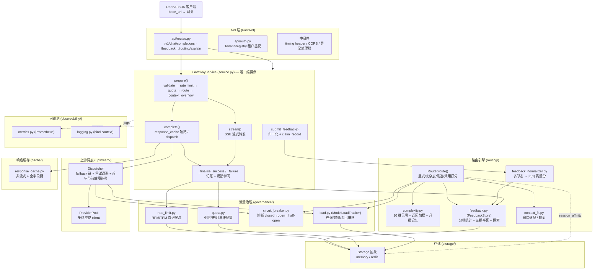
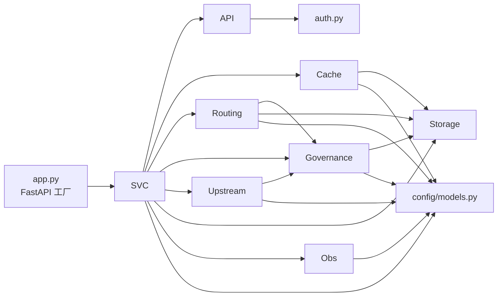
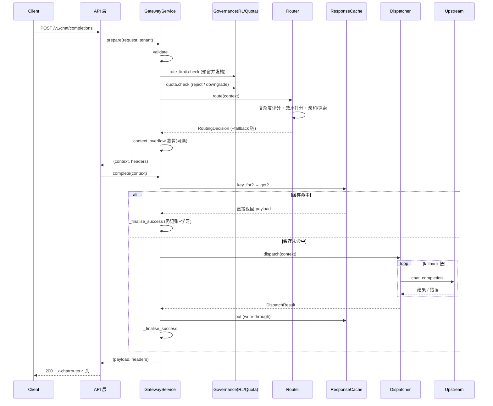

# ChatRouter 架构图

## 1. 运行时分层架构（请求生命周期视角）

```mermaid
flowchart TD
    Client["OpenAI SDK 客户端<br/>base_url → 网关"] --> API

    subgraph APILayer["API 层 (FastAPI)"]
        API["api/routes.py<br/>/v1/chat/completions · /feedback · /routing/explain"]
        Auth["api/auth.py<br/>TenantRegistry 租户鉴权"]
        MW["中间件<br/>timing header / CORS / 异常处理器"]
    end

    API --> SVC

    subgraph SVC["GatewayService (service.py) — 唯一编排点"]
        direction TB
        PREP["prepare()<br/>validate → rate_limit → quota → route → context_overflow"]
        COMPLETE["complete()<br/>response_cache 短路 / dispatch"]
        STREAM["stream()<br/>SSE 流式转发"]
        FINAL["_finalise_success / _failure<br/>记账 + 反馈学习"]
        FEED["submit_feedback()<br/>归一化 + claim_record"]
    end

    API --> PREP
    PREP --> COMPLETE
    PREP --> STREAM
    COMPLETE --> FINAL
    STREAM --> FINAL

    subgraph Routing["路由引擎 (routing/)"]
        ROUTER["Router.route()<br/>显式/复杂度/候选/效用打分"]
        COMPLEX["complexity.py<br/>10 维信号 + 近因加权 + 升级记忆"]
        FEEDBK["feedback.py (FeedbackStore)<br/>分档统计 + 证据半衰 + 探索"]
        NORM["feedback_normalizer.py<br/>多形态 → [0,1] 质量分"]
        CTXFIT["context_fit.py<br/>窗口适配 / 裁剪"]
    end

    subgraph Governance["流量治理 (governance/)"]
        RL["rate_limit.py<br/>RPM/TPM 双维限流"]
        QUOTA["quota.py<br/>小时/天/月三维配额"]
        BREAKER["circuit_breaker.py<br/>熔断 closed→open→half-open"]
        LOAD["load.py (ModelLoadTracker)<br/>在途/容量/溢出排队"]
    end

    subgraph Upstream["上游调度 (upstream/)"]
        DISP["Dispatcher<br/>fallback 链 + 重试退避 + 首字节前故障转移"]
        POOL["ProviderPool<br/>多供应商 client"]
    end

    subgraph Cache["响应缓存 (cache/)"]
        RC["response_cache.py<br/>非流式 + 全字段键"]
    end

    subgraph Storage["存储 (storage/)"]
        STORE["Storage 抽象<br/>memory / redis"]
    end

    subgraph Obs["可观测 (observability/)"]
        METRICS["metrics.py (Prometheus)"]
        LOG["logging.py (bind context)"]
    end

    ROUTER --> COMPLEX
    ROUTER --> FEEDBK
    ROUTER --> CTXFIT
    ROUTER --> LOAD
    ROUTER --> BREAKER
    FEEDBK --> STORE
    NORM --> FEEDBK

    COMPLETE --> RC
    COMPLETE --> DISP
    DISP --> POOL
    DISP --> BREAKER
    DISP --> LOAD

    RL --> STORE
    QUOTA --> STORE
    LOAD --> STORE
    ROUTER -.session_affinity.-> STORE

    FINAL --> RL
    FINAL --> QUOTA
    FINAL --> FEEDBK
    FEED --> NORM

    SVC -. metrics.-> METRICS
    SVC -. logs.-> LOG
```

---

## 2. 模块依赖关系（编译期 import 图）

```mermaid
flowchart LR
    App["app.py<br/>FastAPI 工厂"] --> SVC
    SVC --> API
    SVC --> Cache
    SVC --> Routing
    SVC --> Governance
    SVC --> Upstream
    SVC --> Storage
    SVC --> Obs
    SVC --> Config["config/models.py"]

    Routing --> Governance
    Routing --> Storage
    Routing --> Config
    Governance --> Storage
    Governance --> Config
    Upstream --> Governance
    Upstream --> Config
    Cache --> Storage
    Cache --> Config
    API --> Auth["auth.py"]
    Obs --> Config
```

---

## 3. 一次请求的状态流（prepare → complete）

```mermaid
sequenceDiagram
    participant C as Client
    participant API as API 层
    participant S as GatewayService
    participant G as Governance(RL/Quota)
    participant R as Router
    participant RC as ResponseCache
    participant D as Dispatcher
    participant U as Upstream

    C->>API: POST /v1/chat/completions
    API->>S: prepare(request, tenant)
    S->>S: validate
    S->>G: rate_limit.check (预留并发槽)
    S->>G: quota.check (reject / downgrade)
    S->>R: route(context)
    R->>R: 复杂度评分 + 效用打分 + 亲和/探索
    R-->>S: RoutingDecision (+fallback 链)
    S->>S: context_overflow 裁剪(可选)
    S-->>API: (context, headers)

    API->>S: complete(context)
    S->>RC: key_for? → get?
    alt 缓存命中
        RC-->>S: 直接返回 payload
        S->>S: _finalise_success (仍记账+学习)
    else 缓存未命中
        S->>D: dispatch(context)
        loop fallback 链
            D->>U: chat_completion
            U-->>D: 结果 / 错误
        end
        D-->>S: DispatchResult
        S->>RC: put (write-through)
        S->>S: _finalise_success
    end
    S-->>API: (payload, headers)
    API-->>C: 200 + x-chatrouter-* 头
```
